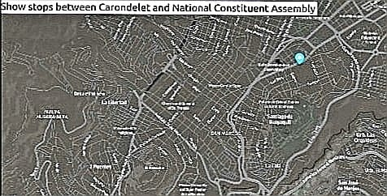

# Real Time Bus Tracker
## Real Time Bus Tracker

**Project description:**

Performs an animated tracking of the route of the main bus stops from the Carondelet palace or presidential palace to the National Constituent Assembly of Ecuador located in Quito, Ecuador. It is in black background.

**How it is executed:**

To run the index.html file in any empty tab of your web server Firefox, Chrome, etc and click where it says "Show stops between Carondelet and National Constituent Assembly" and you will see the trajectory of the bus stops between those two points.

**Roadmap of Future Improvments:**

It can be improved by setting stop times for each bus line, service hours, ticket sales, drivers' names.

**License Information** 

MIT License.

